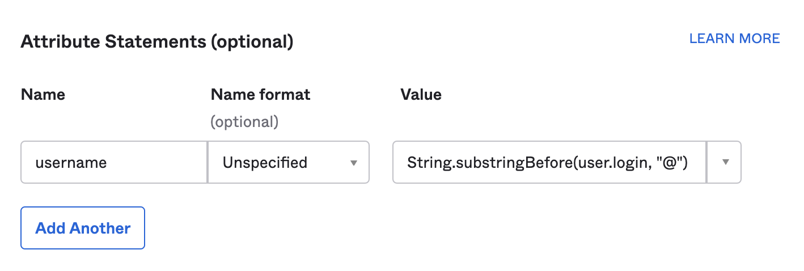

# Configure SSO with SAML using Okta

## Overview

Cloud Pak for Data can be configured to use external authenitcation through a SAML provider. If this is to be implemented, it should be implemented immediately after installation of the base and before the addition of any end-users to CPD. These steps are based on the [documentation for single sign-on](https://www.ibm.com/support/knowledgecenter/SSQNUZ_3.5.0/cpd/install/saml-sso.html).

To understand authentication flow when using SAML, see the following diagram (from: [https://developer.okta.com/docs/concepts/saml/](https://developer.okta.com/docs/concepts/saml/) ).


For Cloud Pak for Data, the CDP platform will be the Service Provider and in the example Okta will be the Identity Provider.

Follow these steps to set up SSO:

* [Add application to the Identity Provider](#add-application-to-the-identity-provider)
* [Update configuration on CPD](#update-configuration-on-cpd)
* [Add external users and test](#add-external-users-and-test)
* [Disable the default admin user](#disable-the-default-admin-user)

## Add Application to the Identity Provider

Follow these steps with Okta, or any SSO IDP which does not accept an input SAML export. Begin by creating a new application in the IDP and select to use SAML 2.0 as the authenticaion method.

In Okta, you will be prompted for an application name which can be "Cloud Pak for Data" or more specific as desired. It's ok to retain defaults for the rest of the settings on the first page. Proceed to the **Next** panel.

* Configure the SAML properties. The most important and first is the **Single Sign On URL**, this will be required by any SAML IDP. Use the route to the instance with `/auth/login/sso/callback` appended.

    ```console
    cpdhost=$(oc get route cpd -n <cpd-namespace> -o=jsonpath='{.spec.host}{"\n"}')
    echo "https://$cpdhost/auth/login/sso/callback"
    ```

* Define a Service Provider entity id - this is also referred to as the **issuer** in the CPD documentation. If unset, it will default to `ibm_privatecloud`. In this example the Service Provider entity id will be `cp4d-partner-roks`.

    If you will use userids with no special formatting (e.g. not an email address with a `@` in the middle of the string), select the Name ID format to be **Unspecified**. If you will use userids in an email address format, change the format to **EmailAddress**. You can leave the Application username as the default as an **additional attribute** will be added in the configuration to return the user identifier in the SAML assertion. The value selected here will determine the value used in configuring CPD. If using **Unspecified** the CPD `identifierFormat` should be: `urn:oasis:names:tc:SAML:1.1:nameid-format:unspecified` and when using **EmailAddress** the `identifierFormat` should be `urn:oasis:names:tc:SAML:1.1:nameid-format:emailAddress`.

* Add an additional attribute needs to be added to specify the user identity. Presently the `nameID` property in the Okta SAML assertion is not parsed, requiring this additional attribute. In the **Attribute Statements (optional)** section add an attribute with label `username`, and specify the preferred format. For the value, select either `user.email` if the email is to be used, or if a simple string like the left-hand-side of the Okta login should be used, type in an expression like: `String.substringBefore(user.login, "@")`

    

Click on the **Next** button to continue towards the page with information needed to add to the CP4D instance saml configuration file. To get to the Setup instructions page, let Okta know that this is an internal application and that it is not needed for Okta to reach out to the service provider for more formal support. After clearing the application information panel, click on **View Setup Instructions**

Copy the following data:

* Identity provider single-sign-on URL. This will be used for the `entryPoint` property in the saml config file

* X509 Certificate. This will be used for the `idpCert` property in the saml config file. When adding this to the file, remove the opening and closing `-----BEGIN CERTIFICATE-----` and `-----END CERTIFICATE-----` and remove the hard returns in the file. The value for this property must be in a single line (see example later)

## Update Configuration on CPD

Enter the properties gathered from the IDP configuration step into a `samlConfig.json` file. When complete the minimum version of the file will look like this for simple username string identifiers (instead of an email address identifier):

```json
{
    "entryPoint": "https://dev-93863443.okta.com/app/dev-93863443_cloudpakfordata_1/exkbivbriVNYYtr3f5d6/sso/saml",
    "fieldToAuthenticate": "username",
    "spCert": "",
    "idpCert": 
    "MIIDqDCCApCgAwIBAgIGAXgX/iCDMA0GCSqGSIb3DQEBCwUAMIGUMQswCQYDVQQGEwJVUzETMBEGA1UECAwKQ2FsaWZvcm5pYTEWMBQGA1UEBwwNU2FuIEZyYW5jaXNjbzENMAsGA1UECgwET2t0YTEUMBIGA1UECwwLU1NPUHJvdmlkZXIxFTATBgNVBAMMDGRldi05Mzg2MzQ0MzEcMBoGCSqGSIb3DQEJARYNaW5mb0Bva3RhLmNvbTAeFw0yMTAzMDkxNzE2MTNaFw0zMTAzMDkxNzE3MTNaMIGUMQswCQYDVQQGEwJVUzETMBEGA1UECAwKQ2FsaWZvcm5pYTEWMBQGA1UEBwwNU2FuIEZyYW5jaXNjbzENMAsGA1UECgwET2t0YTEUMBIGA1UECwwLU1NPUHJvdmlkZXIxFTATBgNVBAMMDGRldi05Mzg2MzQ0MzEcMBoGCSqGSIb3DQEJARYNaW5mb0Bva3RhLmNvbTCCASIwDQYJKoZIhvcNAQEBBQADggEPADCCAQoCggEBAIoQS3BeazbQ7NMp/C4jr5rF7iYLsIpiE5W4X4xjA/aVezNOaA/J6oBlOipP9p0B3HKJuHiTT9xYWpZCt2piaxUlrF+G2D8VC9QQ5RNPtXjMoQ4p839ofX7O3yLpSLOyw29rUzapPkwHF/KUUTSVtIcp6NHZb/Wg+VYW+QTWN41P0SpMF2ae0lbmp5M0AtYgxWPn6KNUwV8pbJzzJHbKKjkfrDHyeXgRiXwUEEcWOtGBXGqYXXn4UPtFljnJASjUA9N450ZxfKLes98rjIoFNdp1UOU+T69mlczvdCqYUwwWivZ8vGiH/WfHVGGCiruhYaQX5kGWOaL2s8H8dCNjRkECAwEAATANBgkqhkiG9w0BAQsFAAOCAQEALBdUsv2Yud4Q0k8vsL1T42BgNpOwmUUfu1LT74XEF2bGqGlt1jqmQaTla6P+Ta8MTBLSMayoiy2dgWdnbbBYeki7dOK0CSWimVdl3hnGrdD2H2ma7Edw0I6/761pZx4z7W9aKysts9jAmDdxZdy3qE/4ErmLTiA72xwRkgJdgQTpZNOH0ElHJ7xq9yfaobDg31PwHpUFI6czBNEx8RIF8WIt6GYcrPidNwZomAJYSP3mzNA+AyQjU51iofv1gCEwovyfiW9NRPK/GzZFqMzjADcJ2PNwGYU7u2E0WfryNWXTFBozNvZjooSuS+8Kr7q+YNrkOZml/wsEJkJVQyKT5A==",
    "issuer": "cp4d-timro-roks",
    "identifierFormat": "urn:oasis:names:tc:SAML:1.1:nameid-format:unspecified",
    "callbackUrl": "https://roks-cpd-roks.cp4d35-sso-test-tor-2bef1f4b4097001da9502000c44fc2b2-0000.us-east.containers.appdomain.cloud/auth/login/sso/callback"
}
```

This file needs to be placed in the `/user-home` tree accessed by the `usermgmt` pods. Authenticate to the CP4D cluster using the `oc` cli and then use this command to copy over the file (replace `_namespace_` with the namespace of the CP4D instance):

```console
oc cp ./samlConfig.json _namespace_/$(oc get pod -n _namespace_ -l component=usermgmt | tail -1 | cut -f1 -d\ ):/user-home/_global_/config/saml/samlConfig.json
```

Restart all of the `usermgmt` pods by deleting them (the will be automatically replaced by the replicationController):

```console
oc delete pods -l component=usermgmt
```

## Add external users and test

After waiting for a few minutes for the `usermgmt` pods to restart, select from the CP4D dashboard the **Administration->User management** option. When SSO has been enabled, the **New User** interface will show only a User, Username, and Email address fields.

Add all users that match known users in the IDP. Add at least one user with Administrative role because this will be needed for ongoing administration of CP4D.

Enter into a web browser the CP4D dashboard URL - the user should be immediately redirected to the IDP. After authenticating at the IDP, the user will be returned to the CP4D dashboard.

## Disable the default admin user

Once the IDP is confirmed to be working as intended and an official (non-default) Administrative user (or users) are able to authenticate, the included `admin` user can be [removed the CP4D](https://www.ibm.com/support/knowledgecenter/SSQNUZ_3.5.0/cpd/admin/remove-admin.html). After verifying that another user has Admin access to all required catalogs and categories, run this command (replacing `_namespace_` with the CP4D namespace):

```console
oc exec -it -n _namespace_ $(oc get pod -n _namespace_ -l component=usermgmt | tail -1 | cut -f1 -d\ ) -- bash -c "/usr/src/server-src/scripts/manage-user.sh --disable-user admin"
```
